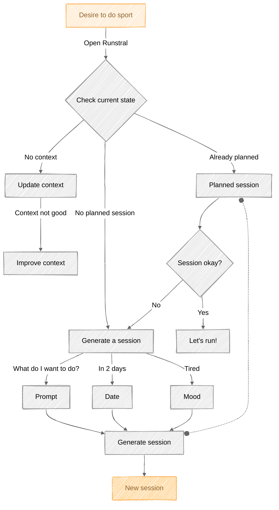

# Runstral 🏃‍♂️

<p align="center">
  
</p>

A running companion powered by Mistral AI and Supabase. [Live Demo here](https://runstral.letoquart.com)

## Video demo

https://github.com/user-attachments/assets/992bb046-52b4-4b0c-b33a-67f4c6f375cf

## Features

- Usage of Mistral AI's API (and formatted output) for high-quality session generation
- Secure user authentication with Supabase and secured Row Level Security (RLS) policies for data isolation

## Prerequisites

Before you begin, ensure you have:
- Node.js
- pnpm or npm or yarn
- A Supabase account
- A Mistral AI API key

## Installation

1. Clone the repository
```bash
git clone git://github.com/PierreLouisLetoquart/runstral.git
cd runstral
```

2. Install dependencies
```bash
pnpm install
```

3. Set up environment variables
```bash
cp .env.local.example .env.local
```

Edit `.env.local` with your credentials:
- `SUPABASE_URL`
- `SUPABASE_ANON_KEY`
- `MISTRAL_API_KEY`

## Database Setup

> [!NOTE]
> Not the smoothest way to work with supabase locally, I'll improve it soon !

Execute the following SQL in your Supabase SQL editor:

```sql
CREATE TABLE public.sessions (
    id bigint primary key generated always as identity,
    created_at timestamp with time zone default now() not null,
    user_id uuid references auth.users(id) on delete cascade,
    day date not null,
    duration integer,
    type text,
    intensity text,
    description text,
    completed boolean default false not null,
    warmup text,
    cooldown text,
    displayed boolean default true
) WITH (OIDS=FALSE);

CREATE INDEX idx_sessions_user_id ON public.sessions(user_id);
```

## Usage

Run the development server:

```bash
pnpm run dev
```

Open [http://localhost:3000](http://localhost:3000) in your browser.

## License

This project is licensed under the MIT License - see the [LICENSE](LICENSE) file for details.

## Acknowledgments

- [Mistral AI](https://mistral.ai) for the AI capabilities
- [Supabase](https://supabase.io) for the backend infrastructure

---

Note: This is a super quick prototype, so please be indulgent. ;) A lot more needs to be done to create an interesting POC.

## Draft

> [!NOTE]
> Here are some notes and diagrams that I'll use to develop the project...

These are the really first steps of the project, so I'm just writing down some ideas and thoughts. They can be a bit unclear, too advanced or whatever; but they provide a good starting point for the project.

### User Journey


### Flowchart



<p align="center">
  Made with ❤️ by Pierre-Louis Létoquart
</p>
